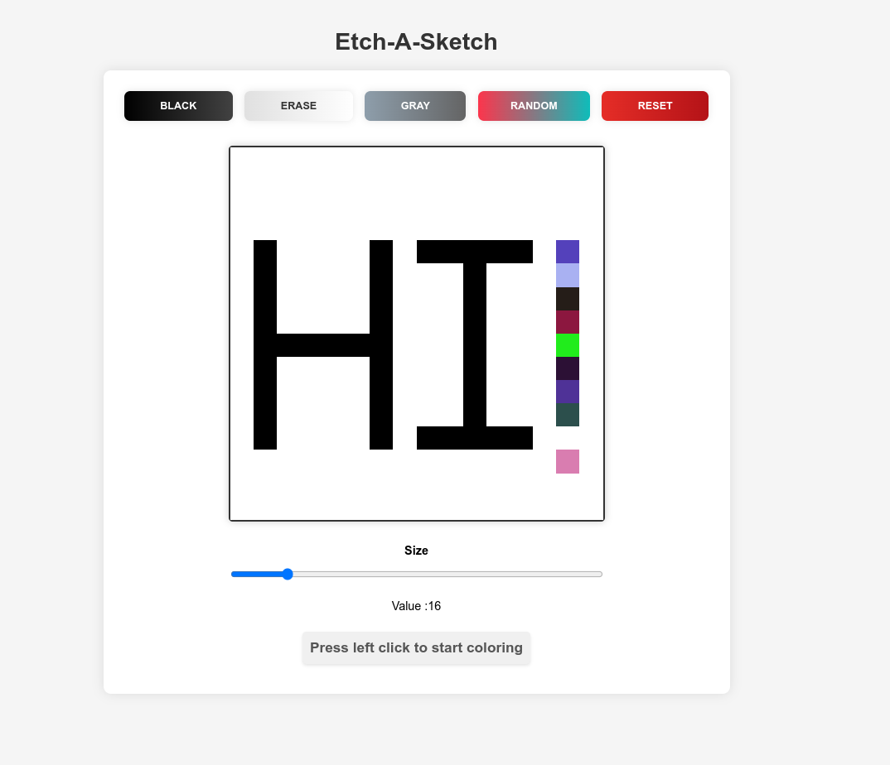

# etch-a-sketch
Simple browser version of something between a sketchpad and an Etch-A-Sketch build as a TOP project

[Play the Demo](https://trishan0.github.io/etch-a-sketch/)

  

    

      
    

  

  
